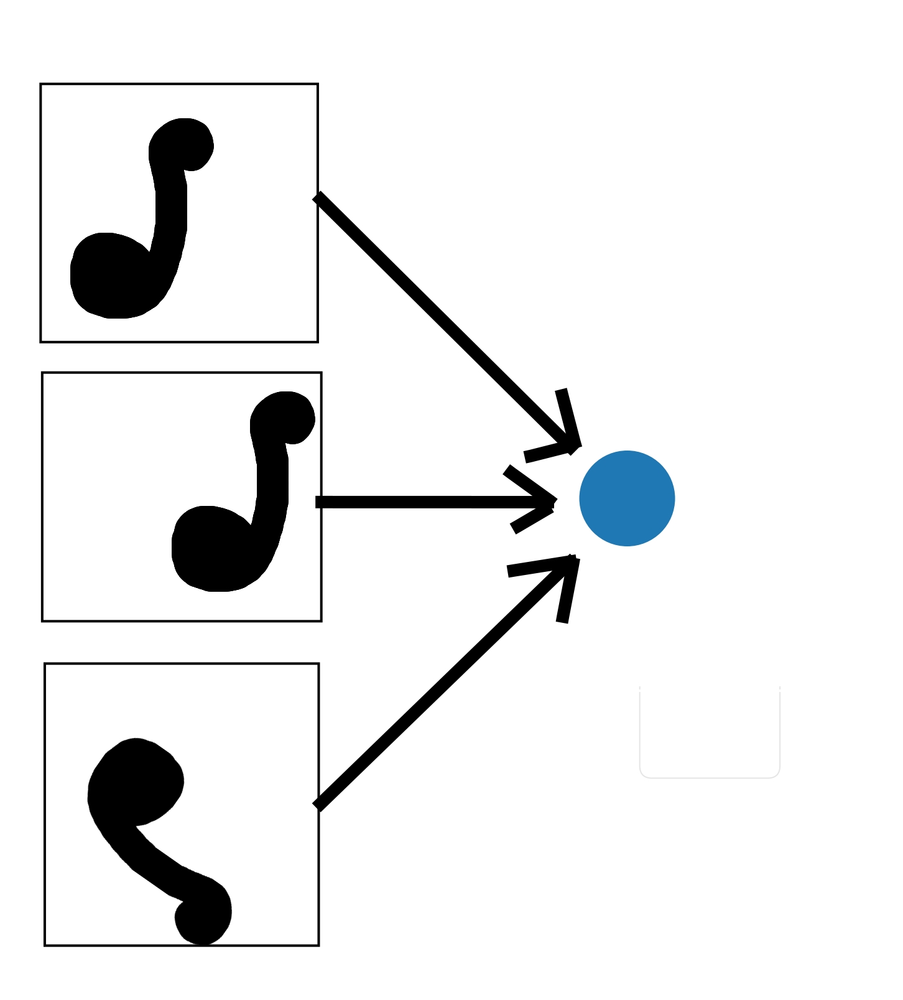
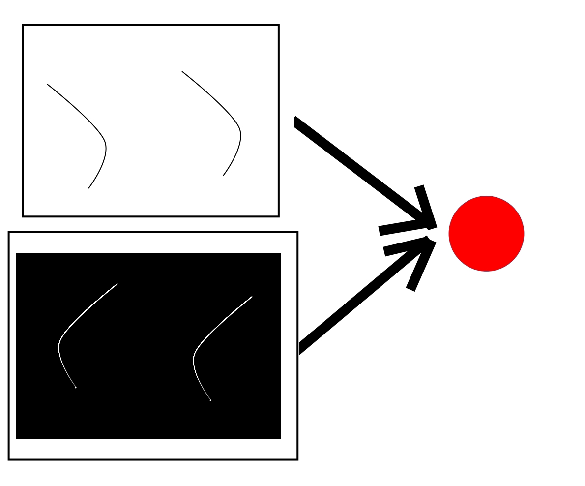

<h1 align="center" style="margin-top: 0px;">Find Strings: Decomposition of Image Data into Invariate Features</h1>

    
    

&emsp;

Our goal is to use non-parametric functions to decompose images into invariate geometric features ("strings"). These features would then provide any trained network with a much smaller input space over which to model the underlying data.

We compute geometric descriptors of generated arcs within an image. The arcs may originate from edge-finding, or some other method of finding more-or-less linear features. We then compare nearby arcs ("strings") and attempt to combine them in such a way that the image-feature they represent is captured in an invariate way (irrespective of scale and rotation). 

As these data extraction techniques are highly experimental and merely prototypes, this project includes no tests and is an early work-in-progress.

UnionFind copied from: [princeton/algs4](http://algs4.cs.princeton.edu/lectures/)